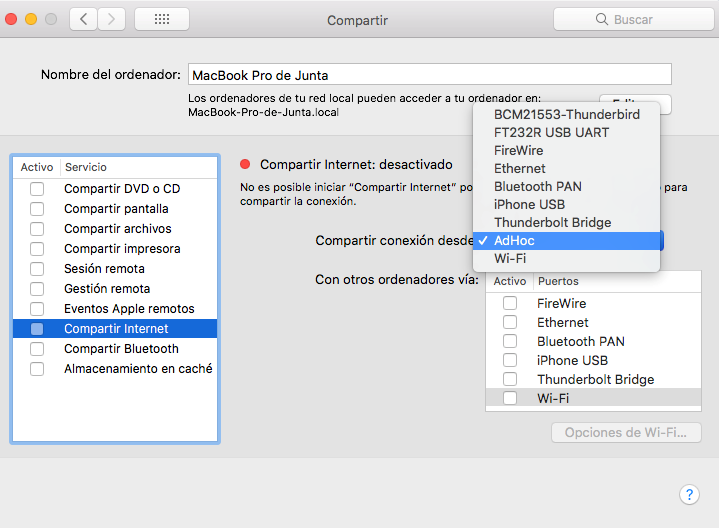
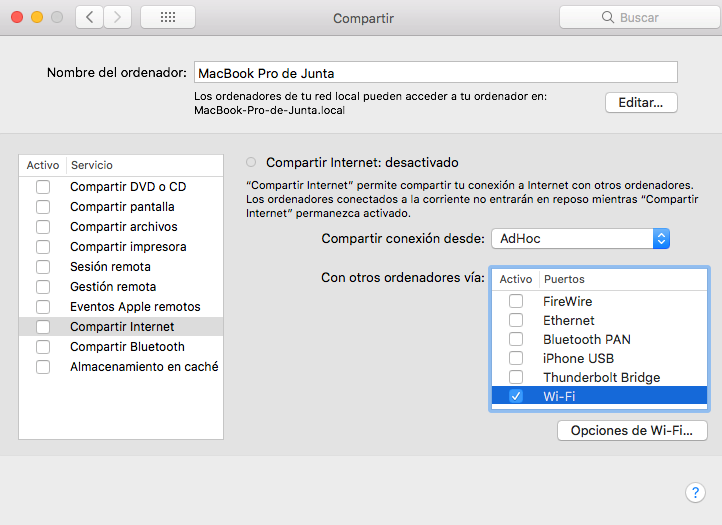
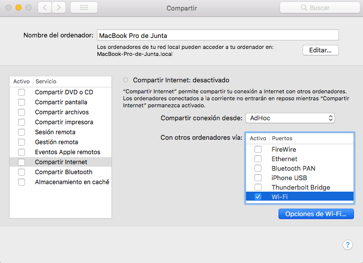
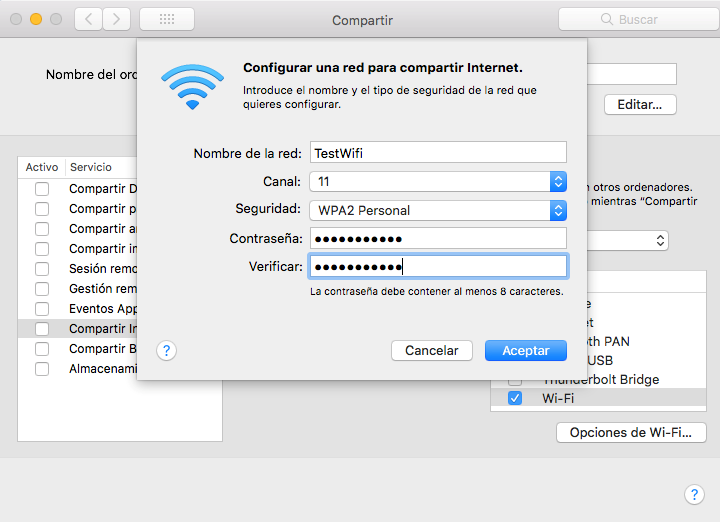
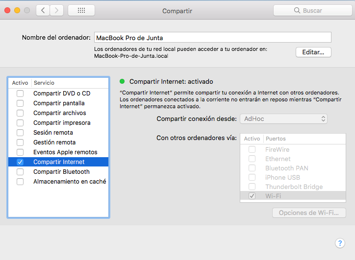
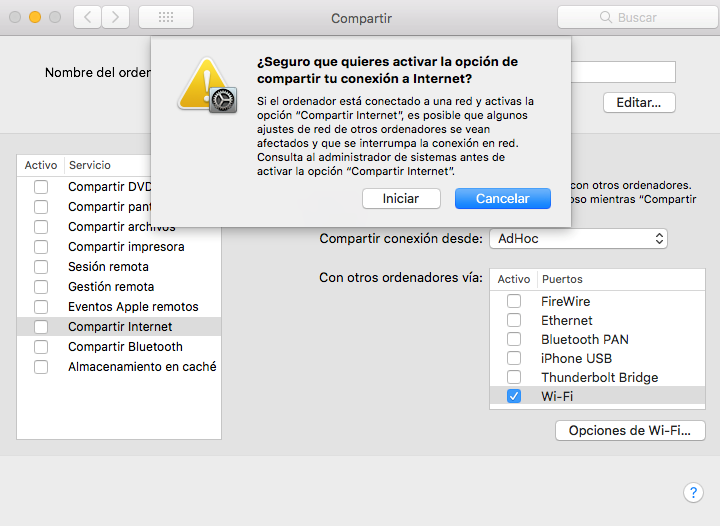
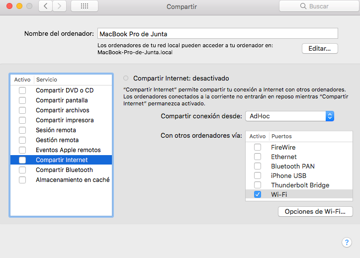

<div id="top"></div>

<h1 align="center">Local architectures for gamified learning and educational assesment</h1>

  <p align="center">
    Design and deployment of local and robust architectures based on wireless connectivity, as well as development of microservices and multi-device web applications and design of user interfaces based on utility.
    <br />
    <a href="https://github.com/TIGE-UPM/LocalArch"><strong>Explore the docs »</strong></a>
    <br />
    <br />
    <a href="https://github.com/TIGE-UPM/LocalArch">View Demo</a>
    ·
    <a href="https://github.com/TIGE-UPM/LocalArch/issues">Report Bug</a>
    ·
    <a href="https://github.com/TIGE-UPM/LocalArch/issues">Request Feature</a>
  </p>
</div>

<!-- TABLE OF CONTENTS -->
<details>
  <summary>Table of Contents</summary>
  <ol>
   <li>
      <a href="#hotspot">Launching the hotspot</a>
      <ul>
         <li><a href="#windows">Windows</a></li>
         <li><a href="#linux">Linux</a></li>
         <li><a href="#macos">macOS</a></li>
      </ul>
   </li>
  </ol>
</details>

<!-- GETTING STARTED -->
<div id="hotspot"></div>

## Step 1: Launching a hotspot 

First, a hotspot must be launched from the educators computers, so the students can connect to the web application through their preferred web browser on any device. For the following explanation we'll be setting up a hotspot with `` SSID = "TestWifi" `` and `` password = "MrSmith2022" ``, and if there is a need to setup a new interface we'll name it `` "AdHoc" ``.

### Windows

We utilize the native Windows tool "Hosted Network" to generate the hotspot with the next commands.
1. Check that the system allows Hosted Network by running the following command:
   ```sh
   netsh wlan show drivers
   ```
2. Create and allow the hosted network, where the network name (HOTSPOT_NAME) and password (HOTSPOT_PASSWORD) must be specified:
   ```sh
   netsh wlan set hostednetwork mode=allow ssid="HOTSPOT_NAME" key="HOTSPOT_PASSWORD" keyUsage=persistent
   ```
   For example:
   ```sh
   netsh wlan set hostednetwork mode=allow ssid="TestWifi" key="MrSmith2022" keyUsage=persistent
   ```
3. Start the hosted network:
   ```sh
   netsh wlan start hostednetwork
   ```
4. Stop the hosted network:
   ```sh
   netsh wlan stop hostednetwork
   ```
5. To remove the hostpot completely:
   ```sh
   netsh wlan set hostednetwork mode=disallow
   ```
<p align="right">(<a href="#top">back to top</a>)</p>

### Linux

We utilize the *nmcli* command, used for NetworK Management from the command line.
1. The system must support AP interface mode. This can be checked using the following command:
   ```sh
   iw list
   ```
2. We also need the name for the Wi-fi Interface, this can be found with the following command:
   ```sh
   ip link show
   ```
3. Now we must create the network and specify the name of the new interface and of the hotspot:
   ```sh
   nmcli con add type wifi ifname "WIFI_INTERFACE_NAME" con-name "HOTSPOT_INTERFACE_NAME" autoconnect yes ssid "HOTSPOT_NAME"
   ```
   For example:
    ```sh
   nmcli con add type wifi ifname "wlp0" con-name "AdHoc" autoconnect yes ssid "TestWifi"
   ```
4. Now we must sep up the connection method:
   ```sh
   nmcli con modify "AdHoc" 802-11-wireless.mode ap 802-11-wireless.band bg ipv4.method shared
   ```
5. Then we must sep up the password for the hotspot:
   ```sh
   nmcli con modify "HOTSPOT_INTERFACE_NAME" wifi-sec.key-mgmt wpa-psk
   nmcli con modify "HOTSPOT_INTERFACE_NAME" wifi-sec.psk "HOTSPOT_PASSWORD"
   ```
   For example:
   ```sh
   nmcli con modify "AdHoc" wifi-sec.key-mgmt wpa-psk
   nmcli con modify "AdHoc" wifi-sec.psk "MrSmith2022"
   ```

6. Finally we activate the hotspot:
   ```sh
   nmcli con up "AdHoc"
   ```
7. To turn off the hotspot we just have to run this command:
   ```sh
   nmcli con down "AdHoc"
   ```
<p align="right">(<a href="#top">back to top</a>)</p>


### macOS

We have not founf a way to launch a hotspot entirely from the command line, so the host (educator) will have to perform some guided steps in the GUI of the system preferences.
1. First two commands must be run with admin privileges to create a new interface. We have chosen to set 192.168.137.1 as the IP address:
   ```sh
   sudo networksetup -createnetworkservice HOTSPOT_INTERFACE_NAME lo0
   sudo networksetup -setmanual HOTSPOT_INTERFACE_NAME 192.168.137.1 255.255.255.255
   ```
   For example:
   ```sh
   sudo networksetup -createnetworkservice AdHoc lo0
   sudo networksetup -setmanual AdHoc 192.168.137.1 255.255.255.255
   ```
2. Now we run the following command to open the "Internet Sharing" tab:
   ```sh
   open “x-apple.systempreferences:com.apple.preferences.sharing?Internet” 
   ```
3. Then we must chose the name of our new interface from the "Share your connection from:" dropdown menu, and then tick "Wi-Fi" from the "To computer using:" menu:
   <div align="center">
   
   
   <div>

4. Then we must click on "Wi-Fi Options" and set the desired name and password for our hotspot (the channel can be left on the value by default) and click OK:
   <div align="center">
   
   
   <div>
5. Finally we just have to tick the box next to "Internet Sharing" and click "Start" on the pop up window to start the hotspot. To turn the hotspot off we just have to untick the box again:
   <div align="center">
   
   
   <div>

6. To turn the hotspot off we just have to untick the box again:
   <div align="center">
   
   <div>

<p align="right">(<a href="#top">back to top</a>)</p>
